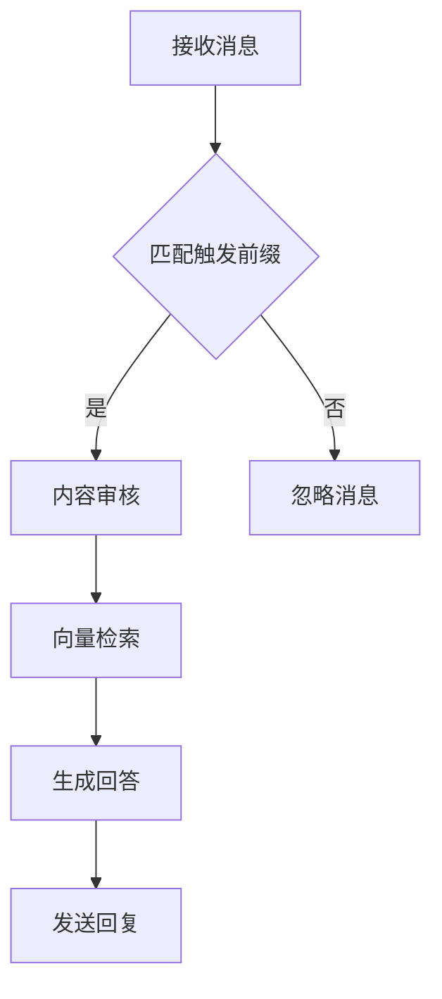

## Doris微信插件开发指南

### 消息处理流程


### 核心配置项
```python
# 在config.json中添加：
"wechat": {
    "enable": true,             # 是否启用微信插件
    "trigger_prefix": "#ask",   # 触发前缀
    "admin_users": ["user1"],   # 管理员列表
    "rate_limit": 5             # 每分钟请求限制
}
```

### 扩展点示例
```python
class DorisPlugin(Plugin):
    
    @plugins.on(Event.ON_MESSAGE)
    def handle_message(self, context):
        """基础消息处理"""
        
    @plugins.schedule(interval=3600)
    def hourly_update(self):
        """定时更新索引"""
        
    @plugins.command(name="doris_stats")
    def show_stats(self, context):
        """自定义统计命令"""
```

### 性能优化建议
1. 使用LRU缓存高频查询
```python
from functools import lru_cache

@lru_cache(maxsize=1000)
def cached_query(question):
    return rag_engine.query(question)
```

2. 异步处理耗时操作
```python
async def async_query(question):
    return await asyncio.to_thread(rag_engine.query, question)
``` 